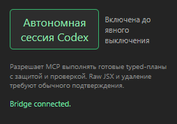

# Облачная задача: автономный режим Antigravity для AE Agent 3.3.0

Статус подготовки: **packet_ready; implementation NOT_STARTED; dispatch pending user-provided task link**. Ветка: `codex/antigravity-autonomy`; продуктовый baseline `b119ce67b0f775ad391719e4551623f0c3cd6c3a`. Первый пакет опубликован в `33c3f960b07082de44493707445db72f4edb8f9d`; точный актуальный source commit закрепляется в стартовом поручении исходного локального чата.

## Запуск облачной задачи

Задача ещё не отправлена: CLI read-only task list пуст, `codex cloud exec` завершился с `no cloud environments are available for this workspace`, а read-only browser route перенаправил на страницу входа/маркетинга. Вход не выполнялся; скрытый fallback не используется. Пользователь выбрал native Codex Cloud в приложении. В стартовом тексте ниже замените TASK_SOURCE_SHA точным опубликованным commit из исходного локального чата:

```text
Продолжи работу над AE Agent 3.3.0 в репозитории aitonpro54/AE_agent на ветке codex/antigravity-autonomy, начиная строго с опубликованного commit TASK_SOURCE_SHA. Прочитай docs/antigravity-autonomy-cloud-task.md и выполни содержащийся там ограниченный scope, критерии офлайн-приёмки и handoff. Этот документ и commit — исходная задача/контракт и имеют приоритет над старым start_skill задачи диагностики. Работай только облачным Codex: не запускай локальный Flash/AGY, AE/CEP, модели, providers или пользовательские credentials; не делай push, PR или merge. Сохраняй работу в reviewable commits согласно packet, обновляя Progress/Decision Log/Validation плана на каждом milestone. Верни commit IDs, diff, SHA-256 файлов, точные команды/результаты проверок, gaps и локальные activation steps.
```

Маршрут выбран, но задача ещё не создана/не связана: ожидается ссылка, которую предоставит пользователь. Этот packet не означает, что облачная задача уже выполняется.

## Цель и пользовательский контракт

Добавить в CEP вторую кнопку, визуально и по поведению повторяющую текущую «Автономная сессия Codex», расположенную непосредственно ниже и названную «Автономная сессия Antigravity». Это два взаимоисключающих переключателя одного серверного владельца: `codex`, `antigravity` или `off`. Одновременно активен максимум один; выключенное состояние обоих разрешено и возвращает ручной CEP flow. Существующее включение Codex при первом доверенном подключении панели сохраняется. Явное выключение Codex остаётся выключенным; новые старые boolean-записи мигрируют `true → codex`, `false → off`, отсутствующая настройка получает прежнее значение по умолчанию. Повреждённое состояние закрывает автономную авторизацию. Поздняя запись старого boolean-клиента не должна отключать или переизбирать владельца Antigravity.



Скриншот — только визуальный пример текущего состояния: зелёная кнопка Codex, пояснение о typed tools/подтверждениях и Bridge connected. Не делайте выводов о наличии или работе второй кнопки по этому изображению.

## Полномочия и протокол

Оба владельца получают одинаковый полный каталог уже существующих typed read/build/proposal/dry-run/server-proposed mutation/read-back возможностей и одинаковые ручные gates. Toggle не управляет поиском/сбором кандидатов, продвижением рецептов, статистикой или выбором Codex-модели. Raw JSX, direct mutations и destructive/protected raw/delete/save операции сохраняют свои нынешние подтверждения; автономный режим не ослабляет их.

Сервер хранит одно `desiredOwner: codex|antigravity|off`. Личность клиента определяется двумя раздельными server-side сопоставленными automation credentials: текущий `AE_BRIDGE_TOKEN` остаётся ролью Codex, для Antigravity вводится отдельный automation secret, provisioned только через доверенную локальную server configuration. Новую credential UI не добавлять. Panel credential и automation credentials остаются разными. Имя модели, request header, UI-переключатель и клиентское заявление не подтверждают личность. Не выводить и не копировать реальные секреты; в примерах использовать только имена переменных и placeholders.

Каждый proposal, dry-run receipt и execution связывается с server-issued `ownerClientId` и `authorityEpoch`, плюс со всеми существующими tuple guards (action/revision/hash, project/session и срок). Повторно проверять владельца и epoch на всех alias/маршрутах: в момент proposal, выдачи и асинхронной регистрации, dry-run, CAS/перехода состояния и непосредственно до каждого исполнения/submit. При смене владельца epoch увеличивается; stale aliases и незавершённые async registration не могут принять результат после смены. Нельзя усыновлять, подтверждать, вытеснять или исполнять чужой pending proposal, lease, run или receipt; существующий контракт «новый pending proposal заменяет старый» должен стать owner-scoped. Ручной panel adoption допустим только для freshly proposed action с текущими owner/epoch и provenance, после нового успешного dry-run; старый или чужой receipt не переносится и не наследуется.

Переключение отзывает старые queued, ещё не submitted команды. Уже submitted команды не объявлять отменёнными: дождаться их фактического завершения, прочитать состояние и зафиксировать partial/unknown результат. Пока выполняется reconciliation, новый владелец не получает mutation authority. Затем старый владелец отзывается, а новый начинает с нового proposal и нового успешного dry-run; lease не наследуется. Таймаут/unknown, незавершённый run, pending command или ошибка persist блокируют выдачу полномочий и повтор операции до read-only reconciliation. Ручной flow при `off` остаётся доступен.

При cancel применяются TTL и точная проверка владельца/панели; владельцы не могут отменить чужую работу. После рестарта panel identity/connection generation свежие, прежний lease не восстанавливается. Persisted desired owner можно сохранить, но при недоступной identity автономная authority выключена до свежего доверенного подключения. Откат функции переводит Antigravity в `off`, отзывает её queued authority и не восстанавливает устаревшее предпочтение; далее работает Codex в прежней семантике или ручной режим. Не допускать, чтобы старый boolean write незаметно восстановил Codex.

## Провайдер и делегирование

Сохранять версию **3.3.0**. Автостарт adapter использует полную существующую server configuration и не подменяет Codex automation token токеном панели/Antigravity. Общие CLI настройки и независимый выбор модели Codex-чата не меняются. Пользовательский routing остаётся прежним: при активном Codex Flash может подготовить draft/materials, но только Codex предлагает, dry-run и запускает server-authorized typed plan. Делегированный Flash/Antigravity не получает временную или неявную mutation authority; переключение владельца не выполняется автоматически.

Сохранить существующий каталог `agy-bridge` и CLI. Краткий контракт для исполнителя: общий bridge — отдельный проект (`C:/Users/Ant/Documents/Codex/agy-bridge`, проверенный HEAD `7ea628f0a94303999da8f53938988e3890635281` на момент подготовки), AE Agent — клиент с `config/agy-bridge.json`; профиль `ae-agent` задаёт модель `gemini-3.8-flash-high` и настроенный effort `high` (это значения конфигурации; эффективный effort может быть неизвестен). Использовать `run`, `status` и `diagnostics` существующего CLI, штатный singleton process и закреплённые resources. Не создавать второй bridge, сервер/очередь или альтернативный fallback; не читать/переносить runtime state, conversations, пользовательский config либо секреты. Соседний проект не менять.

## Владение исходниками и последовательность

Менять только необходимые текущие точки входа: `mcp-server/autonomous-session.js`, `http-boundary.js`, `proposal-state.js`, `bridge-daemon.js`, `mcp-adapter.js` и CEP panel. Обновить документацию/API/tool guidance так, чтобы Codex и Antigravity имели один явно описанный контракт. Новую архитектуру не вводить; расширять существующие identity, proposal, lease, queue и read-back механизмы. Frozen Intake/importer boundary `config/frozen-intake-manifest.json` не трогать; зависимости и провайдеры не менять.

Разбить работу на три reviewable milestones, каждый со своим commit и записью `Progress`, `Decision Log`, `Validation` в плане:

1. Контракт полномочий, миграция persisted state и серверные guards/epoch/CAS.
2. CEP переключатель, раздельная credential mapping и adapter/integration.
3. Offline acceptance и эксплуатационная документация.

## Offline-приёмка

Выбрать фактически изолированные группы autonomy, panel-auth, planning и recovery; сначала проверить их scope. Добавить/использовать настоящие module-level offline tests с fake transport/storage, не выдавая их за live proof. Минимальная матрица: клиенты Codex/Antigravity × owner `codex`/`antigravity`/`off`; межклиентский spoof; вызов каждого alias; гонки переключения с queued/leased/submitted и async CAS registration; отсутствие чужого pending supersede/receipt/run; старые true/false/missing и corrupt persisted state; restart с новой identity; partial/unknown reconciliation без blind retry; raw/delete/save confirmation; ручной CEP flow в `off`; старый boolean write после выбора Antigravity. Дополнительно — целевые синтаксические проверки всех изменённых JS, `npm run check:rules` (на Linux использовать `npm`, не `npm.cmd`) и `git diff --check`. Не запускать live AE/CEP, модельные вызовы/Flash/AGY, provider изменения, установку/активацию, save/reopen, push, PR или merge.

## Условие передачи локальному контроллеру

Завершённый облачный пакет пометить только `offline_ready`. Вернуть базовый и итоговый commit, diff stat, SHA-256 каждого переданного файла, команды и результаты проверок, известные пробелы/ограничения доказательств и точные шаги handoff. Если remote недоступен — собрать проверяемый Git bundle; remote не менять и не отправлять изменения.

Локальная активация — отдельный этап после проверки diff/commit/bundle и offline suites: зарегистрировать настоящие раздельные automation credentials в фактическом MCP server с минимальным scope; установить/перезагрузить только предусмотренную CEP-копию в idle-порядке, сверив точный target/hash; получить фактический скриншот двух кнопок, проверить default Codex, persistence, переключение на Antigravity, `off` и затем Codex, restart и reconciliation. На disposable project выполнить по одной обратимой typed operation от каждого владельца с обычными proposal → dry-run → server-run → независимый read-back; отдельно проверить защищённые raw/delete/save confirmation и ручной flow. Сохранить пользовательские AEP/preferences до тестов. Не объявлять локальную активацию или acceptance завершённой без этих фактических read-back и UI evidence; cloud offline tests сами по себе этого не доказывают.
